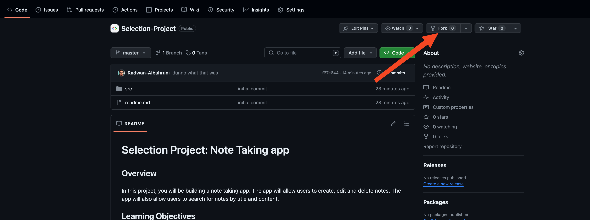
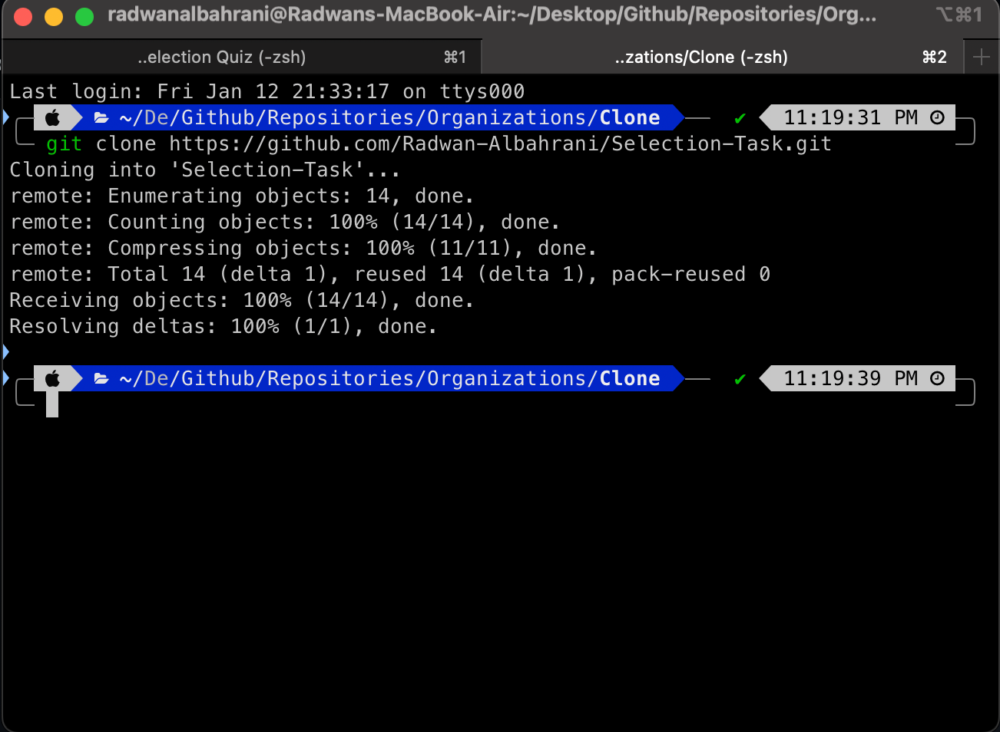

# Git and Github Tutorial

## Overview

This tutorial will guide you through the process of setting up your development environment and contributing to a project on GitHub.

## Learning Objectives

- Understand the basics of Git and GitHub.
- Learn how to clone a repository.
- Learn how to add changes to a repository.
- Learn how to commit changes to a repository.
- Learn how to push changes to a repository.
- Learn how to create a pull request.

## Resources

- [Git and Github](https://www.youtube.com/watch?v=tRZGeaHPoaw)
- [Git Tutorial (w3schools.com)](https://www.w3schools.com/git/default.asp)
- [How to Use Git and GitHub – Introduction for Beginners (freecodecamp.org)](https://www.freecodecamp.org/news/introduction-to-git-and-github/)
- [Learn Git Branching](https://learngitbranching.js.org/) (Interactive tutorial)
- [Git - Basic Branching and Merging (git-scm.com)](https://git-scm.com/book/en/v2/Git-Branching-Basic-Branching-and-Merging)
- [Pull Requests in VS Code - YouTube](https://www.youtube.com/watch?v=LdSwWxVzUpo)

## Setup and Installation

### 1. Setup

#### 1.1. Install Git (Windows Users Only)

- [Download Git](https://git-scm.com/downloads)

#### 1.2. Install VS Code

- [Download VS Code](https://code.visualstudio.com/download)

#### 1.3 Fork the repository

- Fork the repository by clicking the fork button on the top right corner of the repository page.
  - Click the fork Button

  

  - Name the repo and click "Create fork"
  

  - You should now have a copy of the repository on your own account.
  

### Tutorial

#### 2.1. Git and GitHub

This section will guide you through the process of cloning a repository, adding changes, committing changes, pushing changes, and creating a pull request.

#### 2.1.0. Configure Git

- Open the terminal and run the following commands to configure Git:

```bash
git config --global user.name "<your-name>"
git config --global user.email "<your-email>"
```

These commands will set your name and email for Git. This information will be used to identify you as the author of the changes you make.

Example:

```bash
git config --global user.name "John Doe"
git config --global user.email "JohnDoe@gmail.com"
```

##### 2.1.1. Clone the repository

- Open the terminal and navigate to the directory (also known as folder) where you want to clone the repository.
  - Make sure the path you choose has NO ARABIC LETTERS. This will cause errors.
    - On Mac:
  
    - On Windows:
  
- Go to the repository page on **your own account** and click on the green code button.
- Copy the link under the clone section.

- Run the following command inside of the opened terminal to clone the repository:

```bash
git clone <The Link from your Repository>
```

Example:

```bash
git clone https://github.com/YOUR_NAME/Selection-Project.git
```



##### 2.1.2. Add changes

- Open the repository directory in VS Code.
  - The path must be INSIDE the cloned repository.
  - Click on File -> Open folder
  
  - Select the repository folder.
  
  - The repository should be opened in VS Code.
  
  - To make sure, run the following command in the terminal INSIDE Vscode:

  ```bash
  git status
  ```

  - The output should be similar to the following:
  

- Run the following command to add the changes:

```bash
git add .
```

##### 2.1.3. Commit changes

- Run the following command to commit the changes:

```bash
git commit -m "<commit-message>"
```

##### 2.1.4. Push changes

- Run the following command to push the changes:

```bash
git push
```


##### 2.1.5. Create a pull request

- Go to the repository page and click on the pull request button.

- Click on the new pull request button.

- Select the branch you want to merge into the main branch.

- Click on the create pull request button.

- Add a title and description for the pull request. Title should be in the following format: `<your-name> - <project-name>`.

- Click on the create pull request button.


#### 2.2. Git Branching

Usually, you will be working on a feature or a bug fix in a separate branch. This is to avoid conflicts with the main branch and to keep the main branch clean.

##### 2.2.1. Create a new branch

- Run the following command to create a new branch:

```bash
git checkout -b <branch-name>
```

Example:

```bash
git checkout -b feature-1
```

##### 2.2.2. Switch to a branch

- Run the following command to switch to a branch:

```bash
git checkout <branch-name>
```

Example:

```bash
git checkout main
```

##### 2.2.3. Merge branches

- Run the following command to merge a branch into the main branch:

```bash
git merge <branch-name>
```

Example:

```bash
git merge feature-1
```

#### 2.3. Git Collaboration

This section will guide you through the process of collaborating with others on a project.

##### 2.3.1. Add a remote repository

- Run the following command to add a remote repository:

```bash
git remote add <remote-name> <remote-url>
```

Example:

```bash
git remote add origin https://github.com/Programming-Club-IAU/Level-1.1.git
```

##### 2.3.2. Fetch changes

- Run the following command to fetch changes from a remote repository:

```bash
git fetch <remote-name>
```

Example:

```bash
git fetch origin
```

##### 2.3.3. Pull changes

- Run the following command to pull changes from a remote repository:

```bash
git pull <remote-name> <branch-name>
```

Example:

```bash

git pull origin main
```

##### 2.3.4. Add Collaborators

- Go to the repository page and click on the settings tab.
- Click on the manage access button.
- Click on the invite a collaborator button.
- Search for the username of the collaborator you want to add.
- Click on the add collaborator button.

## Conclusion

This tutorial has covered the basics of Git and GitHub. You should now be able to clone a repository, add changes, commit changes, push changes, create a pull request, create a new branch, switch to a branch, merge branches, add a remote repository, fetch changes, pull changes, and add collaborators.
